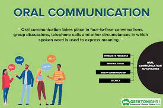
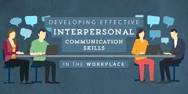
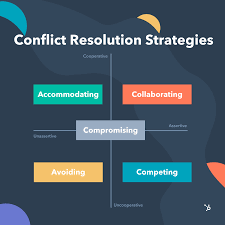

# ePortfolio
<html>
  <head>
    <body>
    <h1>Explain communication concepts and strategies</h1>
    
    <h2>show confidence and skils in oral communication and presentation</h2>
    
    <h3>work effectively as part of a team</h3>
      
    <h4>communcation effectively in a professional context</h4>
    
    <h5>define and demonstarte conflict management and resolution strategies</h5>
    
    </body>
  </head>
      
    
